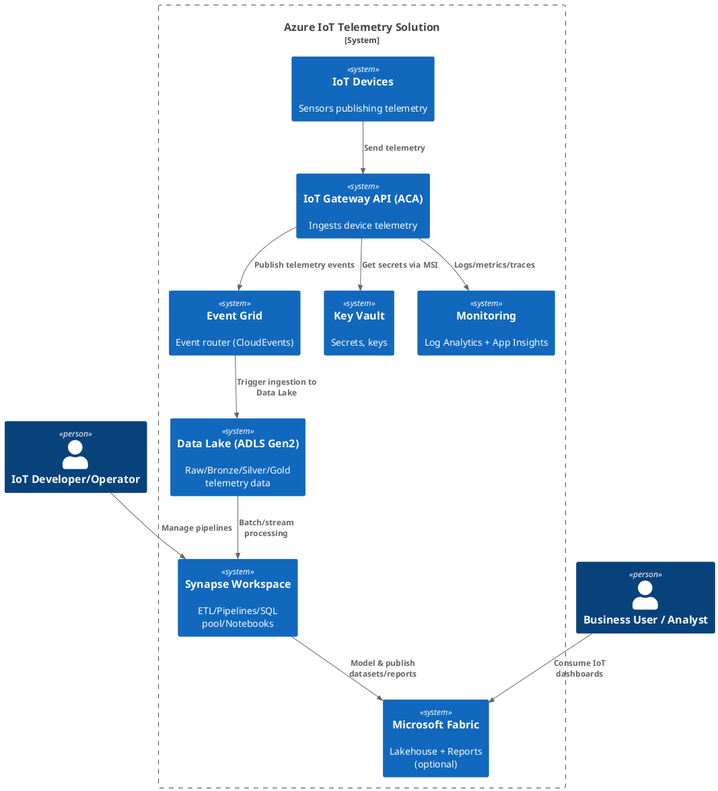
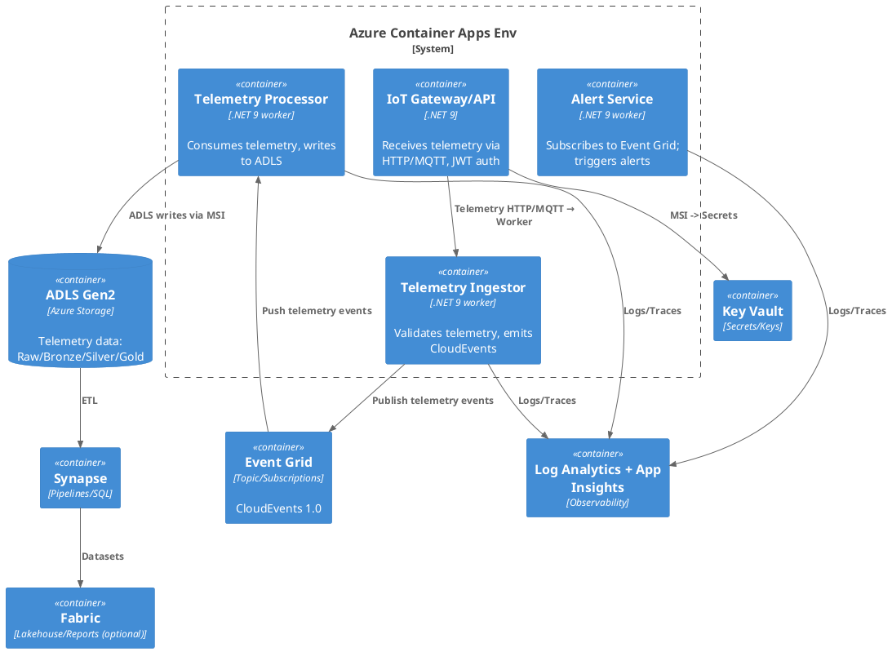

# Azure IoT Telemetry Reference Architecture

A professional, production-ready **reference architecture** and **template codebase** for building **IoT telemetry solutions** on **Microsoft Azure** using:

- **Azure Container Apps (ACA)** – for microservices and APIs
- **Azure Event Grid** – for event routing (CloudEvents 1.0)
- **Azure Data Lake Storage Gen2 (ADLS)** – for raw/bronze/silver/gold telemetry data
- **Azure Synapse Analytics** – for pipelines, SQL, and notebooks
- **Microsoft Fabric (optional)** – for lakehouse, semantic models, and reports
- **Azure Key Vault, Log Analytics, App Insights** – for security and observability

This repository provides:
- Infrastructure as Code (**Terraform** modules, Bicep optional)
- .NET 9 sample services (Minimal API, Workers, CloudEvents integration)
- CI/CD pipelines with **GitHub Actions**
- Security and cost-optimization best practices
- C4 diagrams and architecture documentation

---

## 📐 Architecture Overview

### C1: System Context Diagram


### C2: Container Diagram


---

## 🚀 Features

- **IoT telemetry ingestion** with CloudEvents standard
- **Secure IoT microservices** via Entra ID + Managed Identity
- **Observability**: OpenTelemetry + App Insights + Log Analytics
- **Data Lake zones**: raw → bronze → silver → gold for telemetry
- **Analytics-ready**: Synapse pipelines and optional Fabric IoT dashboards
- **IaC-first**: Terraform modules for ACA, Event Grid, ADLS, Synapse, Key Vault, Monitoring
- **CI/CD pipelines**: GitHub Actions for infra + apps
- **Cost-aware**: autoscale ACA (minScale=0 workers), Synapse pause, storage lifecycle policies

---

## 📂 Repository Structure
```
azure-iot-telemetry-reference-architecture/
├─ docs/
│  ├─ architecture.md
│  ├─ security.md
│  ├─ operations.md
│  └─ diagrams/
├─ infra/
│  ├─ terraform/
│  │  ├─ envs/
│  │  └─ modules/
│  └─ bicep/
├─ src/
│  ├─ gateway-api/           # .NET 9 Minimal API for IoT devices
│  ├─ telemetry-ingestor/    # Worker publishes telemetry events
│  ├─ telemetry-processor/   # Worker consumes telemetry → ADLS
│  └─ alert-service/         # Example subscriber (alerts)
├─ data/
│  ├─ synapse/
│  └─ fabric/
├─ .github/workflows/
│  ├─ ci-build-test.yml
│  ├─ cd-infra-terraform.yml
│  └─ cd-apps-aca.yml
└─ LICENSE
```

---

## 🔒 Security Baseline
- System-assigned Managed Identity for all Container Apps
- Secrets in Key Vault, no plain-text configs
- Private Endpoints for ADLS, Synapse, Key Vault
- API ingress protected by Entra ID (OIDC)
- RBAC with least privilege (Storage Blob Data Contributor, Synapse roles)
- Defender for Cloud baseline policies

---

## 📊 Observability
- **App Insights + OpenTelemetry** for tracing
- **Log Analytics** workspace with KQL queries for IoT telemetry
- Pre-built dashboards in `/docs/operations.md`

---

## 🛠️ Quickstart
```bash
# Deploy infrastructure (dev environment)
cd infra/terraform/envs/dev
terraform init
terraform apply

# Build and push images
cd src/gateway-api
az acr build --registry <acr_name> --image gateway:latest .

# Deploy apps via GitHub Actions or Terraform
```

---

## 📈 Roadmap
- [ ] Add EDI Processing domain pack
- [ ] Add Fabric IoT Lakehouse starter
- [ ] Blue/green ACA revisions switcher
- [ ] Chaos testing module

---

## 📄 License
This project is licensed under the MIT License. See [LICENSE](LICENSE) for details.

---

## 🤝 Contributing
Contributions are welcome! Please read our [contributing guide](docs/contributing.md).

