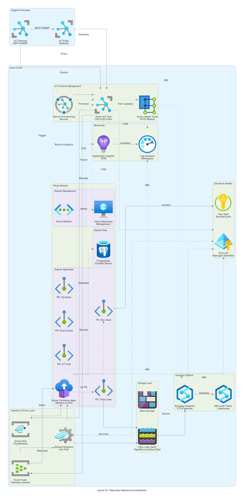

# Azure IoT Telemetry Reference Architecture

A professional, production-ready **reference architecture** and **template codebase** for building **IoT telemetry solutions** on **Microsoft Azure** using:

- **Azure IoT Hub** – secure device connectivity, D2C/C2D messaging, device registry
- **Device Provisioning Service (DPS)** – zero-touch device provisioning at scale
- **Azure IoT Edge** – edge computing with local processing and offline support
- **Azure Digital Twins** – DTDL device models and spatial intelligence
- **Azure Stream Analytics** – real-time stream processing and anomaly detection
- **Azure Event Grid & Event Hubs** – event routing (CloudEvents 1.0) and telemetry streaming
- **Azure Container Apps (ACA)** – microservices and worker processing
- **Azure Data Lake Storage Gen2 (ADLS)** – medallion architecture (raw/bronze/silver/gold)
- **Azure Synapse Analytics** – data pipelines, SQL pools, and notebooks
- **Microsoft Fabric** – lakehouse, semantic models, and Power BI reports
- **Azure Key Vault, Log Analytics, App Insights** – security and observability
- **PostgreSQL, VNet, Private Endpoints** – secure data storage and networking

This repository provides:
- Infrastructure as Code (**Terraform** modules, Bicep optional)
- .NET 9 samplex services (Minimal API, Workers, CloudEvents integration)
- CI/CD pipelines with **GitHub Actions**
- Security and cost-optimization best practices
- C4 diagrams and architecture documentation

---

## Architecture Overview

### Infrastructure Diagram (with Official Azure Icons)

Complete infrastructure diagram with private endpoints, managed identities, VNet topology, and RBAC assignments using **official Azure service icons**.



📄 **[View detailed documentation with data flows and RBAC assignments →](docs/infrastructure-diagram.md)** | 📊 **[Mermaid version](docs/infrastructure-diagram.mmd)**

> **Note**: This diagram is generated using the [Python Diagrams](https://diagrams.mingrammer.com/) library with official Azure icons. To regenerate: `python3 docs/generate_diagram.py`

---

## Features

### IoT Device Management
- **Device provisioning** with DPS (X.509 certificates, TPM, symmetric keys)
- **Device registry** in IoT Hub with per-device authentication
- **Device twins** for state synchronization and configuration management
- **Cloud-to-Device (C2D)** messages for commands and control
- **IoT Edge** deployment for local processing and offline operation
- **Azure Digital Twins** DTDL models for device validation

### Data Processing
- **Hot Path**: Real-time processing with Stream Analytics (windowing, aggregation, anomaly detection)
- **Cold Path**: Batch processing with ACA workers writing to Data Lake
- **Medallion Architecture**: raw → bronze → silver → gold telemetry zones
- **Event-driven**: CloudEvents standard with Event Grid routing

### Security & Networking
- **Private Endpoints** for all data services (IoT Hub, Event Hubs, Storage, Synapse)
- **Managed Identities** for secure, credential-less service-to-service authentication
- **VNet isolation** with dedicated subnets for management, application, and data layers
- **TLS 1.2+** enforced for all device connections
- **Entra ID RBAC** with least privilege access
- **Key Vault** for secrets, certificates, and connection strings

### Analytics & Observability
- **Synapse Analytics** for data warehousing and ETL pipelines
- **Microsoft Fabric** lakehouse with Power BI semantic models
- **Application Insights** with distributed tracing (OpenTelemetry)
- **Log Analytics** workspace with KQL queries for device telemetry
- **Diagnostic settings** enabled on all Azure resources

### Infrastructure & DevOps
- **IaC-first**: Terraform modules for all Azure resources
- **CI/CD pipelines**: GitHub Actions for infrastructure + applications
- **Cost optimization**: ACA autoscale (minScale=0), Synapse pause, storage lifecycle policies
- **PostgreSQL Flexible Server** for application metadata

---

## Repository Structure

```
├── docs/                    # Architecture diagrams and documentation
│   ├── architecture_diagram.png
│   └── infrastructure-diagram.md
├── infra/terraform/         # Infrastructure as Code
│   ├── envs/dev/           # Dev environment (main.tf, variables.tf, outputs.tf)
│   └── modules/            # 11 reusable modules (networking, iot-hub, etc.)
├── src/                     # .NET 9 microservices (Phase 2)
│   ├── gateway-api/
│   ├── telemetry-processor/
│   └── alert-service/
├── data/                    # Analytics pipelines (Phase 3)
│   ├── synapse/
│   └── fabric/
└── .github/workflows/       # CI/CD pipelines
```

---

## Security Baseline
- **Device Authentication**: X.509 certificates or SAS tokens per device
- **Zero public endpoints** for IoT Hub, Event Hubs, Storage, Synapse (private endpoints only)
- **System-assigned Managed Identity** for all services (ACA, IoT Hub, Stream Analytics, Synapse)
- **Secrets in Key Vault**, no plain-text configs or connection strings
- **Private Endpoints** for IoT Hub, Event Hubs, ADLS, Synapse, PostgreSQL, Key Vault
- **VNet isolation** with NSGs and service endpoints
- **TLS 1.2+** enforced for device-to-cloud connections
- **API ingress** protected by Entra ID (OIDC)
- **RBAC with least privilege**: IoT Hub Registry Contributor, Storage Blob Data Contributor, Event Hubs Data Receiver
- **Audit logging** via Log Analytics for device connections and API access
- **Defender for Cloud** baseline policies

---

## Observability
- **App Insights + OpenTelemetry** for tracing
- **Log Analytics** workspace with KQL queries for IoT telemetry
- Pre-built dashboards in `/docs/operations.md`

---

## Getting Started

### Documentation

| Guide | Description |
|-------|-------------|
| [Prerequisites](infra/terraform/PREREQUISITES.md) | Azure subscription, tools, permissions, quotas |
| [Quick Start](infra/terraform/QUICK_START.md) | Deploy full architecture in ~30 minutes |
| [Cookbook](infra/terraform/COOKBOOK.md) | Step-by-step recipes for common tasks |
| [Deployment Guide](infra/terraform/envs/dev/DEPLOYMENT_GUIDE.md) | Detailed deployment options and troubleshooting |
| [Terraform Overview](infra/terraform/README.md) | Module documentation and architecture details |

### Quick Deploy

```bash
cd infra/terraform/envs/dev
cp terraform.tfvars.example terraform.tfvars
# Edit terraform.tfvars and set postgres_admin_password
terraform init
terraform apply
```

Deploys ~70-80 Azure resources in 20-30 minutes. Estimated cost: $219/mo ($138/mo with Stream Analytics paused).

For staged deployment or troubleshooting, see the [Deployment Guide](infra/terraform/envs/dev/DEPLOYMENT_GUIDE.md).


## 📄 License
This project is licensed under the MIT License. See [LICENSE](LICENSE) for details.


