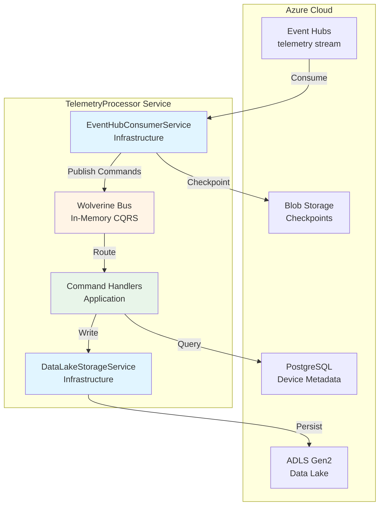
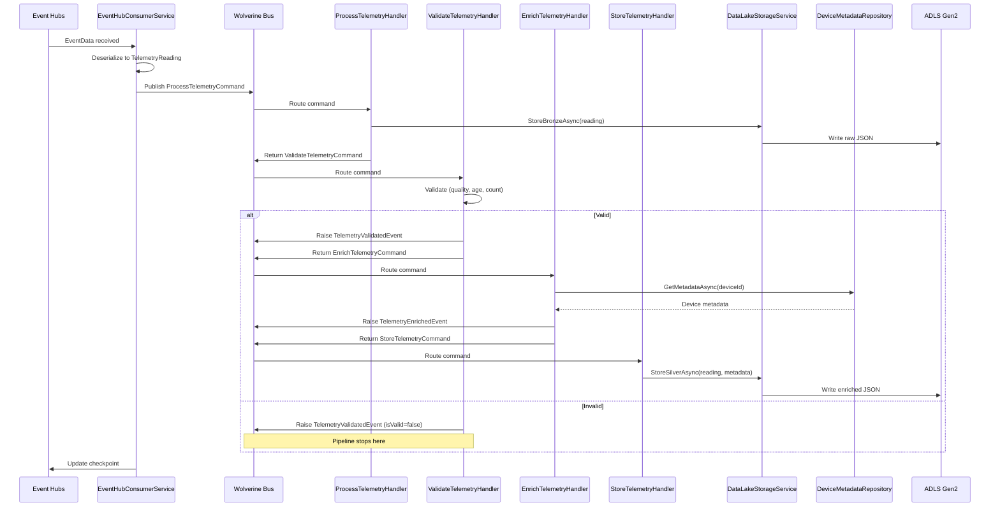
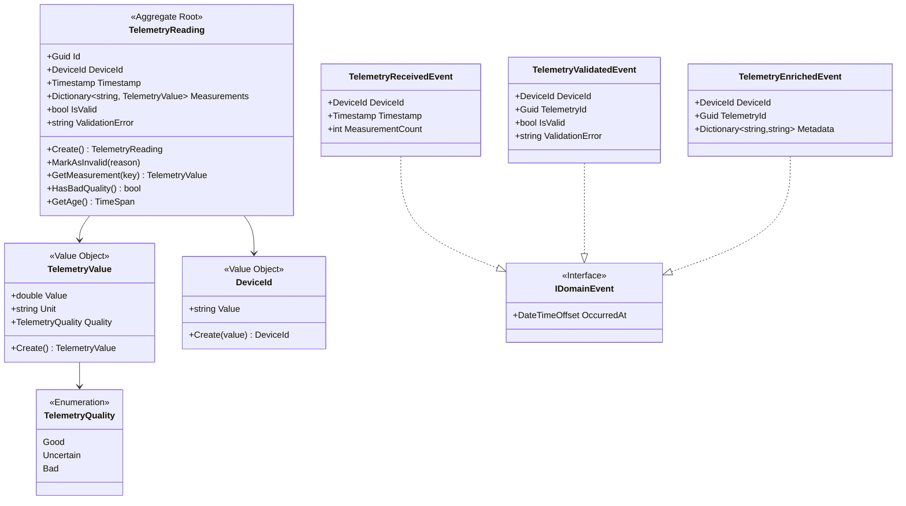
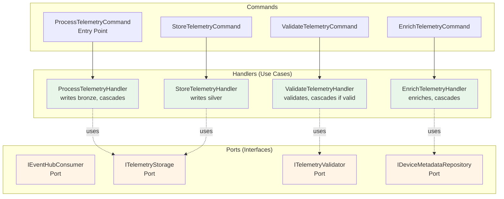
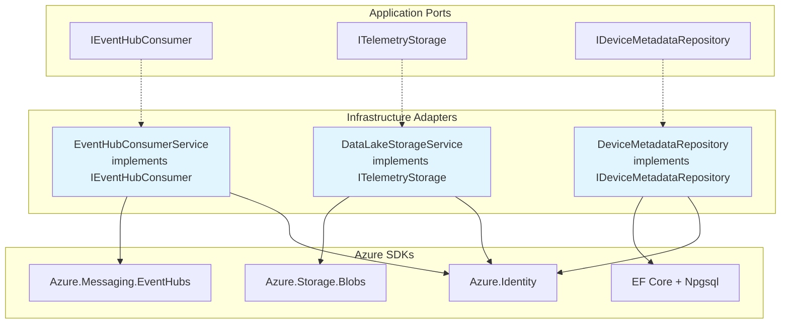
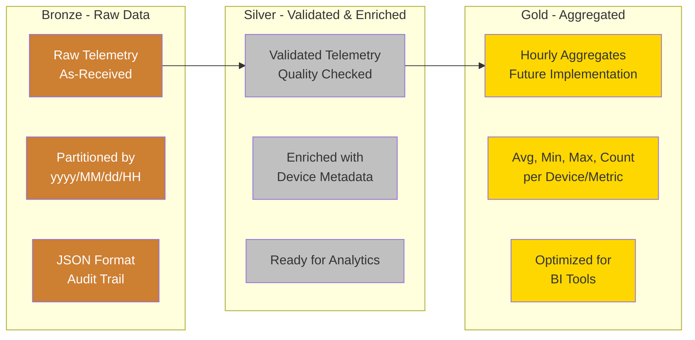
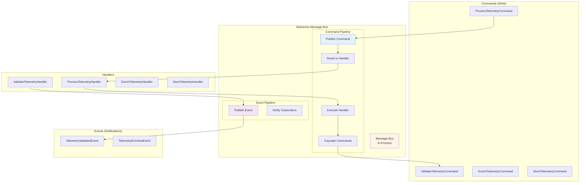
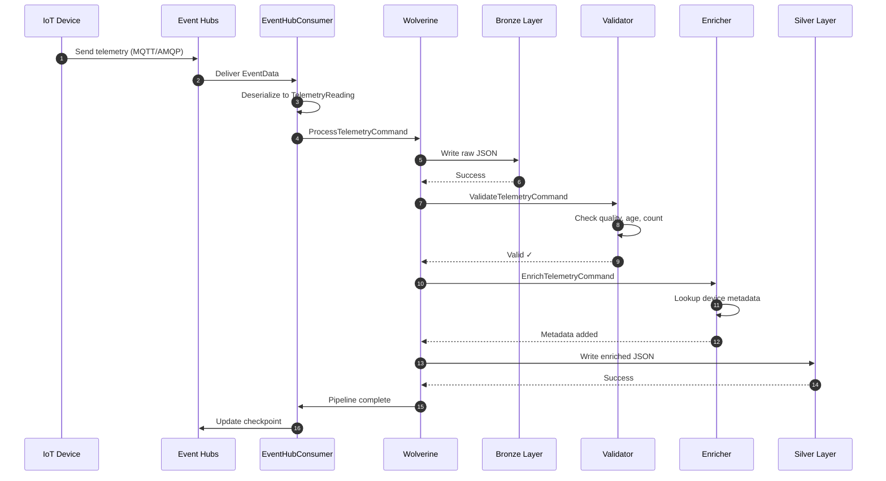
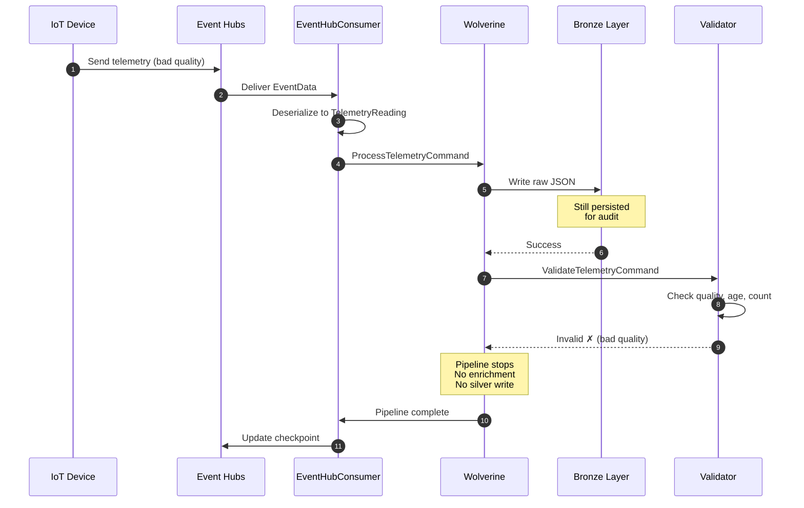

# TelemetryProcessor Service Architecture

**Service:** TelemetryProcessor
**Type:** Worker Service (Background Service)
**Pattern:** Hexagonal Architecture + CQRS
**Status:** ✅ Fully Implemented

## Table of Contents

1. [High-Level Architecture](#high-level-architecture)
2. [Detailed Component Diagram](#detailed-component-diagram)
3. [Processing Flow](#processing-flow)
4. [Data Flow](#data-flow)
5. [Hexagonal Architecture Layers](#hexagonal-architecture-layers)
6. [Medallion Architecture](#medallion-architecture)
7. [CQRS Pattern with Wolverine](#cqrs-pattern-with-wolverine)
8. [Sequence Diagrams](#sequence-diagrams)

---

## High-Level Architecture



---

## Detailed Component Diagram

```mermaid
graph TB
    subgraph "Host Layer"
        PROGRAM[Program.cs<br/>DI Container Setup]
        WORKER[Worker.cs<br/>Background Service]
        CONFIG[appsettings.json<br/>Configuration]
    end

    subgraph "Application Layer"
        subgraph "Ports"
            IEHC[IEventHubConsumer]
            ITS[ITelemetryStorage]
            ITV[ITelemetryValidator]
            IDMR[IDeviceMetadataRepository]
        end

        subgraph "Commands"
            PTC[ProcessTelemetryCommand]
            VTC[ValidateTelemetryCommand]
            ETC[EnrichTelemetryCommand]
            STC[StoreTelemetryCommand]
        end

        subgraph "Handlers"
            PTH[ProcessTelemetryHandler]
            VTH[ValidateTelemetryHandler]
            ETH[EnrichTelemetryHandler]
            STH[StoreTelemetryHandler]
        end

        subgraph "Validators"
            TV[TelemetryValidator]
        end
    end

    subgraph "Infrastructure Layer"
        subgraph "Event Hubs"
            EHCS[EventHubConsumerService]
            EHCO[EventHubConsumerOptions]
        end

        subgraph "Storage"
            DLSS[DataLakeStorageService]
            DLO[DataLakeOptions]
        end

        subgraph "Database"
            DMR[DeviceMetadataRepository]
        end
    end

    subgraph "Domain Layer"
        TR[TelemetryReading<br/>Aggregate]
        TV_VO[TelemetryValue<br/>Value Object]
        DID[DeviceId<br/>Value Object]
        EVENTS[Domain Events]
    end

    PROGRAM --> WORKER
    PROGRAM --> CONFIG
    WORKER --> EHCS

    PTH -.implements.-> IEHC
    VTH -.uses.-> ITV
    ETH -.uses.-> IDMR
    STH -.uses.-> ITS

    EHCS -.implements.-> IEHC
    DLSS -.implements.-> ITS
    TV -.implements.-> ITV
    DMR -.implements.-> IDMR

    PTH --> PTC
    VTH --> VTC
    ETH --> ETC
    STH --> STC

    PTH --> TR
    VTH --> TR
    ETH --> TR
    STH --> TR

    TR --> TV_VO
    TR --> DID
    TR --> EVENTS

    style PROGRAM fill:#f9f9f9
    style EHCS fill:#e1f5ff
    style DLSS fill:#e1f5ff
    style PTH fill:#e8f5e9
    style VTH fill:#e8f5e9
    style ETH fill:#e8f5e9
    style STH fill:#e8f5e9
```



---

## Processing Flow



---

## Data Flow

```mermaid
graph LR
    subgraph "Input"
        RAW[Raw Telemetry<br/>JSON from IoT Hub]
    end

    subgraph "Bronze Layer"
        BRONZE[/bronze/<br/>yyyy/MM/dd/HH/<br/>deviceId_timestamp.json]
    end

    subgraph "Validation"
        VAL{Validate<br/>Quality, Age,<br/>Measurement Count}
    end

    subgraph "Enrichment"
        ENR[Lookup Device<br/>Metadata from<br/>PostgreSQL]
    end

    subgraph "Silver Layer"
        SILVER[/silver/<br/>yyyy/MM/dd/HH/<br/>deviceId_timestamp.json]
    end

    subgraph "Gold Layer (Future)"
        GOLD[/gold/<br/>yyyy/MM/dd/<br/>hourly_aggregates_HH.json]
    end

    RAW --> BRONZE
    BRONZE --> VAL
    VAL -->|Valid| ENR
    VAL -->|Invalid| STOP[Stop Processing]
    ENR --> SILVER
    SILVER -.->|Future| GOLD

    style BRONZE fill:#cd7f32
    style SILVER fill:#c0c0c0
    style GOLD fill:#ffd700
    style STOP fill:#ffcccc
```

---

## Hexagonal Architecture Layers

### 1. Domain Layer (Core)
**Location:** `Shared/IoTTelemetry.Domain`



**Principles:**
- ✅ Pure C# - no infrastructure dependencies
- ✅ Rich domain models with behavior
- ✅ Value objects for type safety
- ✅ Domain events for side effects

---

### 2. Application Layer (Use Cases)
**Location:** `TelemetryProcessor.Application`



**Principles:**
- ✅ No infrastructure code - only interfaces (ports)
- ✅ Pure business logic
- ✅ Commands define intent
- ✅ Handlers orchestrate workflows

---

### 3. Infrastructure Layer (Adapters)
**Location:** `TelemetryProcessor.Infrastructure`



**Principles:**
- ✅ Implements application ports
- ✅ Contains all Azure SDK code
- ✅ Managed identity for authentication
- ✅ Resilience with Polly policies

---

## Medallion Architecture



### Layer Details

| Layer | Purpose | Format | Retention | Use Case |
|-------|---------|--------|-----------|----------|
| **Bronze** | Landing zone, audit trail | Raw JSON | 365 days | Compliance, reprocessing |
| **Silver** | Curated, business-ready | Enriched JSON | 180 days | Analytics, ML training |
| **Gold** | Aggregated, optimized | Aggregates JSON | 730 days | BI dashboards, reporting |

---

## CQRS Pattern with Wolverine



**Wolverine Features Used:**
- ✅ Source-generated handlers (zero reflection)
- ✅ Automatic command routing
- ✅ Cascading messages (return next command)
- ✅ Event publishing
- ✅ Built-in OpenTelemetry

---

## Sequence Diagrams

### Success Path: Valid Telemetry



### Error Path: Invalid Telemetry



---

## Summary

The TelemetryProcessor service implements a **clean architecture** with clear separation of concerns:

1. **Domain Layer** - Pure business logic, no infrastructure
2. **Application Layer** - Use cases and ports (interfaces)
3. **Infrastructure Layer** - Azure SDK adapters
4. **Host Layer** - Composition root and configuration

Key architectural patterns:
- ✅ **Hexagonal Architecture** - Ports & Adapters for testability
- ✅ **CQRS** - Commands for writes, Events for notifications
- ✅ **Medallion Architecture** - Bronze/Silver/Gold data layers
- ✅ **Domain-Driven Design** - Rich domain models with behavior
- ✅ **Event-Driven** - Domain events for observability

This design ensures:
- **Testability** - Mock ports, test handlers in isolation
- **Maintainability** - Clear boundaries, single responsibility
- **Scalability** - Stateless, horizontally scalable
- **Observability** - OpenTelemetry tracing through entire pipeline
