# Azure IoT Telemetry - Infrastructure Diagram

## Detailed Infrastructure with Networking, Security & Identity

```mermaid
graph TB
    subgraph "On-Premises/Edge"
        IoT[IoT Devices/Sensors<br/>MQTT/AMQP]
        EdgeGateway[IoT Edge Gateway<br/>Local Processing]
    end

    subgraph "Azure Subscription"
        subgraph "Virtual Network: vnet-iot-prod"
            subgraph "Subnet: snet-management"
                VM[Virtual Machines<br/>Management/DevOps]
                Bastion[Azure Bastion]
            end

            subgraph "Subnet: snet-application"
                ACA[Azure Container Apps<br/>Gateway API + Workers]
                PE_KV[Private Endpoint<br/>Key Vault]
                PE_ADLS[Private Endpoint<br/>Data Lake]
                PE_PG[Private Endpoint<br/>PostgreSQL]
                PE_SYN[Private Endpoint<br/>Synapse]
                PE_IOT[Private Endpoint<br/>IoT Hub]
                PE_EH[Private Endpoint<br/>Event Hubs]
            end

            subgraph "Subnet: snet-data"
                Postgres[(Azure PostgreSQL<br/>Flexible Server)]
            end
        end

        subgraph "IoT & Device Management"
            IoTHub[Azure IoT Hub<br/>Device Registry/D2C/C2D]
            DPS[Device Provisioning Service<br/>Zero-touch provisioning]
            DigitalTwins[Azure Digital Twins<br/>Device Models/DTDL]
        end

        subgraph "Ingestion & Event Layer"
            EG[Event Grid<br/>CloudEvents Topic]
            EventHub[Event Hubs<br/>Telemetry Stream]
            StreamAnalytics[Stream Analytics<br/>Real-time Processing]
        end

        subgraph "Storage Layer"
            ADLS[(Data Lake Storage Gen2<br/>Raw/Bronze/Silver/Gold)]
            Blob[Blob Storage<br/>Functions/Logs]
        end

        subgraph "Analytics & Data Platform"
            Synapse[Azure Synapse Analytics<br/>Pipelines/SQL Pools/Spark]
            Fabric[Microsoft Fabric<br/>Lakehouse/Semantic Models]
        end

        subgraph "Security & Secrets"
            KV[Key Vault<br/>Secrets/Certificates/Keys]
            EntraID[Microsoft Entra ID<br/>RBAC/Managed Identities]
        end

        subgraph "Monitoring & Observability"
            LA[Log Analytics Workspace<br/>Logs/Metrics/KQL]
            AppInsights[Application Insights<br/>Distributed Tracing/APM]
        end
    end

    %% Data Flow - IoT Device Ingestion
    IoT -->|MQTT/AMQP/HTTPS| EdgeGateway
    EdgeGateway -->|IoT Edge Modules| IoTHub
    IoT -->|Direct Connection| IoTHub
    DPS -.->|Auto-provision devices| IoTHub
    IoTHub -->|Built-in Endpoint<br/>Event Hub compatible| EventHub
    IoTHub -->|Device Events| EG
    IoTHub -.->|Update Twin| DigitalTwins

    %% Stream Processing
    EventHub -->|Hot Path| StreamAnalytics
    StreamAnalytics -->|Real-time Metrics| ACA
    EventHub -->|Cold Path| ACA

    %% Application Layer
    ACA -->|Publish Processed Events| EG
    EG -->|Route Events| EventHub
    ACA -.->|Write Telemetry| PE_ADLS
    PE_ADLS -.-> ADLS
    ACA -.->|Store Metadata| PE_PG
    PE_PG -.-> Postgres

    %% Analytics Pipeline
    ADLS -->|Source Data| Synapse
    Synapse -->|Export Datasets| Fabric
    DigitalTwins -.->|Device Context| Synapse

    %% Management Access
    Bastion -.->|SSH/RDP| VM
    VM -.->|Admin Access| Postgres
    VM -.->|Admin Access| Synapse

    %% Security & Identity (Managed Identity flows)
    ACA -.->|Managed Identity| EntraID
    VM -.->|Managed Identity| EntraID
    Synapse -.->|Managed Identity| EntraID
    IoTHub -.->|Managed Identity| EntraID
    StreamAnalytics -.->|Managed Identity| EntraID

    %% Private Endpoint Connections
    ACA -.->|Private Link| PE_KV
    PE_KV -.-> KV
    ACA -.->|Private Link| PE_SYN
    PE_SYN -.-> Synapse
    ACA -.->|Private Link| PE_IOT
    PE_IOT -.-> IoTHub
    StreamAnalytics -.->|Private Link| PE_EH
    PE_EH -.-> EventHub

    %% RBAC Assignments via Managed Identity
    EntraID -.->|RBAC: Storage Blob<br/>Data Contributor| ADLS
    EntraID -.->|RBAC: Key Vault<br/>Secrets User| KV
    EntraID -.->|RBAC: PostgreSQL<br/>Reader/Writer| Postgres
    EntraID -.->|RBAC: Synapse<br/>Contributor| Synapse
    EntraID -.->|RBAC: IoT Hub<br/>Data Contributor| IoTHub
    EntraID -.->|RBAC: Event Hubs<br/>Data Receiver| EventHub

    %% Monitoring & Observability
    ACA -.->|Logs/Metrics| LA
    VM -.->|Logs/Metrics| LA
    Postgres -.->|Query Logs| LA
    Synapse -.->|Pipeline Logs| LA
    ADLS -.->|Diagnostic Logs| LA
    KV -.->|Audit Logs| LA
    IoTHub -.->|Device Telemetry Logs| LA
    EventHub -.->|Throughput Metrics| LA
    StreamAnalytics -.->|Job Logs| LA

    ACA -.->|Telemetry/Traces| AppInsights
    AppInsights -->|Analytics| LA

    %% Device Management
    VM -.->|Manage Devices| IoTHub
    ACA -.->|C2D Messages| IoTHub

    %% Styling
    classDef security fill:#f9f,stroke:#333,stroke-width:2px
    classDef monitoring fill:#ff9,stroke:#333,stroke-width:2px
    classDef compute fill:#9cf,stroke:#333,stroke-width:2px
    classDef storage fill:#9f9,stroke:#333,stroke-width:2px
    classDef iot fill:#c9f,stroke:#333,stroke-width:2px
    classDef network fill:#fcc,stroke:#333,stroke-width:1px,stroke-dasharray: 5 5

    class KV,EntraID security
    class LA,AppInsights monitoring
    class ACA,VM,Synapse,Fabric,StreamAnalytics compute
    class ADLS,Blob,Postgres storage
    class IoTHub,DPS,DigitalTwins,EdgeGateway iot
    class PE_KV,PE_ADLS,PE_PG,PE_SYN,PE_IOT,PE_EH network
```



## Key Security & Networking Components

### 🔐 Managed Identities
- **Azure Container Apps**: System-assigned managed identity for accessing:
  - Key Vault (secrets retrieval)
  - Data Lake Storage (write telemetry data)
  - PostgreSQL (application database)
  - Event Grid/Event Hubs (publish/subscribe)
  - IoT Hub (cloud-to-device messages, device management)

- **Azure IoT Hub**: System-assigned managed identity for:
  - Event Hubs integration (built-in endpoint routing)
  - Event Grid event publishing
  - Data Lake Storage (message enrichment)

- **Stream Analytics**: System-assigned managed identity for:
  - Event Hubs input (telemetry stream)
  - Data Lake Storage output
  - Container Apps output (real-time alerts)

- **Virtual Machines**: System-assigned managed identity for:
  - Administrative access to data services
  - IoT Hub device management
  - Azure CLI/PowerShell operations

- **Synapse Analytics**: System-assigned managed identity for:
  - Reading from Data Lake
  - Writing processed data
  - Azure Digital Twins queries

### 🔒 Private Endpoints
All data services are accessible only via private endpoints within the VNet:

| Service | Private Endpoint | Purpose |
|---------|------------------|---------|
| **Azure IoT Hub** | `PE_IOT` | Secure device-to-cloud and cloud-to-device messaging |
| **Event Hubs** | `PE_EH` | Private telemetry stream consumption |
| **Key Vault** | `PE_KV` | Secrets/certificates access from ACA |
| **Data Lake Storage** | `PE_ADLS` | Write telemetry data from ACA workers |
| **PostgreSQL** | `PE_PG` | Application database access |
| **Synapse Analytics** | `PE_SYN` | Data processing and analytics |

### 🌐 Network Topology

```
vnet-iot-prod (10.0.0.0/16)
├── snet-management (10.0.1.0/24)
│   ├── Azure Bastion
│   └── Management VMs
├── snet-application (10.0.2.0/23)
│   ├── Azure Container Apps Environment
│   └── Private Endpoints (IoT Hub, Event Hubs, KV, ADLS, PG, Synapse)
└── snet-data (10.0.4.0/24)
    └── PostgreSQL Flexible Server
```

### 🔌 IoT Device Connectivity

**Device Protocols Supported:**
- **MQTT** (v3.1.1 and v5) - Lightweight messaging for constrained devices
- **AMQP** (v1.0) - Enterprise messaging with guaranteed delivery
- **HTTPS** - REST API for simple device integration

**Device Provisioning:**
- **Device Provisioning Service (DPS)** enables zero-touch, just-in-time device provisioning
- Supports X.509 certificates, TPM attestation, and symmetric keys
- Automatic device registration to IoT Hub with load balancing

**IoT Edge:**
- Local processing and filtering at the edge
- Offline operation with message queuing
- Custom modules deployed as containers
- Built-in Azure Stream Analytics, Functions, and ML modules

### 📊 Monitoring Flow
1. **Application Insights**: Real-time APM for Container Apps (distributed tracing, exceptions, performance)
2. **Log Analytics**: Central log aggregation from all services
3. **Diagnostic Settings**: Enabled on all Azure resources → Log Analytics

### 🎯 RBAC Assignments

| Identity | Role | Resource | Purpose |
|----------|------|----------|---------|
| **IoT Hub** | Azure Event Hubs Data Sender | Event Hubs | Route device messages to Event Hubs |
| **IoT Hub** | EventGrid EventSubscription Contributor | Event Grid | Publish device lifecycle events |
| **Stream Analytics** | Azure Event Hubs Data Receiver | Event Hubs | Consume telemetry stream |
| **Stream Analytics** | Storage Blob Data Contributor | ADLS Gen2 | Write hot path analytics |
| **ACA Managed Identity** | Storage Blob Data Contributor | ADLS Gen2 | Write telemetry data |
| **ACA Managed Identity** | Key Vault Secrets User | Key Vault | Read connection strings/secrets |
| **ACA Managed Identity** | Azure Event Hubs Data Sender | Event Hubs | Publish processed events |
| **ACA Managed Identity** | IoT Hub Registry Contributor | IoT Hub | Device management, C2D messages |
| **Synapse Managed Identity** | Storage Blob Data Contributor | ADLS Gen2 | ETL pipelines |
| **Synapse Managed Identity** | Azure Digital Twins Data Reader | Digital Twins | Query device models |
| **VM Managed Identity** | IoT Hub Registry Contributor | IoT Hub | Administrative device management |
| **VM Managed Identity** | Reader | All Resources | Monitoring/diagnostics |

---

## Data Flow Summary

### Hot Path (Real-time Processing)
1. **IoT Devices** → **IoT Hub** (MQTT/AMQP/HTTPS with device authentication)
2. **IoT Edge** → **IoT Hub** (pre-filtered telemetry from edge modules)
3. **IoT Hub** → **Event Hubs** (built-in Event Hub-compatible endpoint)
4. **Event Hubs** → **Stream Analytics** (real-time aggregation, filtering, windowing)
5. **Stream Analytics** → **ACA** (real-time alerts and metrics)
6. **Stream Analytics** → **ADLS** (hot path storage for recent data)

### Cold Path (Batch Processing)
1. **IoT Hub** → **Event Hubs** (all device messages)
2. **Event Hubs** → **ACA Workers** (batch consumption via managed identity)
3. **ACA Workers** → **ADLS** (write to bronze/silver/gold layers via private endpoint)
4. **ADLS** → **Synapse** (batch ETL pipelines, aggregations)
5. **Synapse** → **Fabric** (lakehouse analytics, Power BI datasets)

### Device Management
1. **Device Provisioning Service** → **IoT Hub** (auto-provision new devices)
2. **ACA/VM** → **IoT Hub** (cloud-to-device messages, device twin updates)
3. **IoT Hub** → **Azure Digital Twins** (sync device state with digital models)
4. **Digital Twins** → **Synapse** (provide device context for analytics)

### Event-Driven Architecture
1. **IoT Hub** → **Event Grid** (device lifecycle events: created, deleted, connected)
2. **Event Grid** → **ACA Workers** (trigger workflows based on device events)
3. **ACA Workers** → **Event Grid** (publish business events)

---

## Security Posture

✅ **Device Authentication**: X.509 certificates or symmetric keys per device
✅ **Zero public endpoints** for data services (IoT Hub, Event Hubs, Storage, Synapse)
✅ **Managed identities** eliminate credential management across all services
✅ **Private endpoints** for all internal communication within VNet
✅ **Network isolation** via VNet subnets with NSGs and service endpoints
✅ **TLS 1.2+** enforced for all device-to-cloud connections
✅ **Device Provisioning Service** for secure, zero-touch onboarding
✅ **Azure Digital Twins** DTDL models for device validation
✅ **Audit logging** via Log Analytics for all access (device connections, API calls)
✅ **Entra ID authentication** for API ingress and service-to-service communication

## Azure IoT Services Used

### 📡 Azure IoT Hub
- **Purpose**: Secure, bi-directional communication between IoT devices and cloud
- **Features**:
  - Device registry and identity management
  - Per-device authentication (X.509, SAS tokens)
  - Device-to-Cloud (D2C) telemetry ingestion
  - Cloud-to-Device (C2D) commands and messages
  - Device twins for state synchronization
  - Built-in Event Hub-compatible endpoint for message routing
  - Message enrichment with device metadata

### 🔧 Device Provisioning Service (DPS)
- **Purpose**: Zero-touch, just-in-time device provisioning at scale
- **Features**:
  - Automatic device registration to appropriate IoT Hub
  - Load balancing across multiple IoT Hubs
  - Multi-tenancy support with allocation policies
  - Support for X.509, TPM, and symmetric key attestation

### 🏢 Azure Digital Twins
- **Purpose**: Create digital representations of physical IoT devices and environments
- **Features**:
  - DTDL (Digital Twins Definition Language) models
  - Device twin synchronization with IoT Hub
  - Spatial intelligence and relationship modeling
  - Integration with Synapse for contextual analytics

### ⚡ Azure Stream Analytics
- **Purpose**: Real-time stream processing of telemetry data
- **Features**:
  - SQL-like query language for stream transformations
  - Tumbling/hopping/sliding windows for time-based aggregations
  - Anomaly detection with built-in ML models
  - Outputs to ACA (alerts), ADLS (hot path), Power BI (dashboards)

### 🌐 IoT Edge
- **Purpose**: Extend cloud intelligence to edge devices
- **Features**:
  - Local data processing and filtering
  - Offline operation with intelligent message queuing
  - Deploy Azure services as edge modules (Stream Analytics, Functions, ML)
  - Custom module deployment via container registry

